# azure_certifications

## THE first Certifications tracks you have to Start with 
### Optional certification track but its important to have it 

## Link for details of AZ-900

[AZ900](https://docs.microsoft.com/en-us/learn/certifications/azure-fundamentals/#certification-exam-disclaimers)

### AZ-900 Certification Summary 

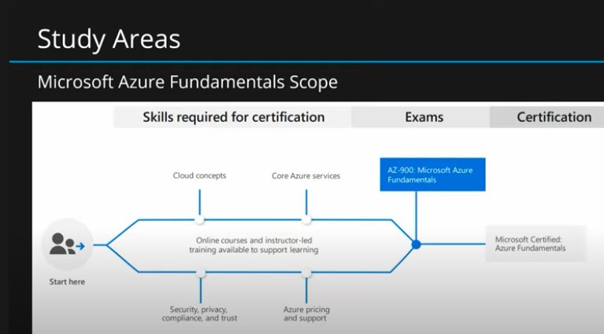

### Skill scale for this certification 

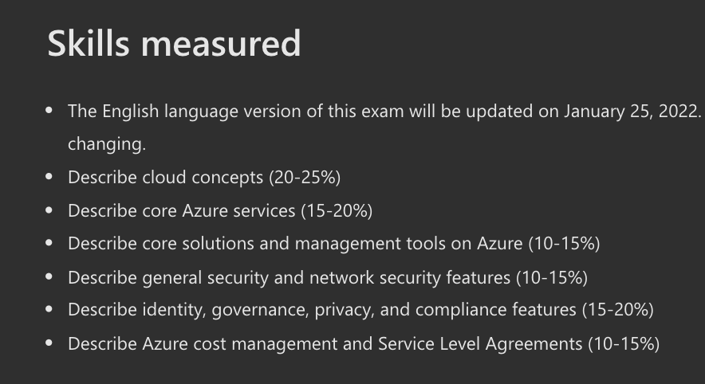

## Free Online study guide with scale 

[az900_docs](https://docs.microsoft.com/en-us/learn/certifications/exams/az-900)

## Cloud Concepts 

### Agility 👍  -- To allocate and Deallocate as much as possible 

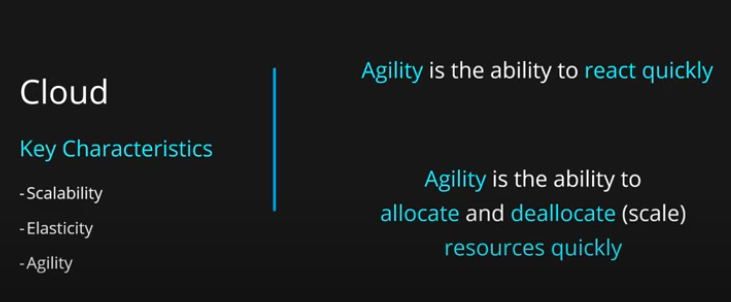

### HA -- COncept 

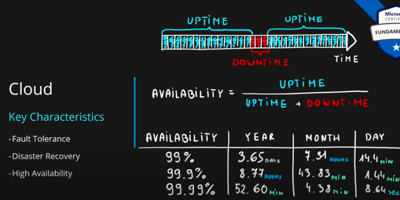

## Cloud Delivery Model 

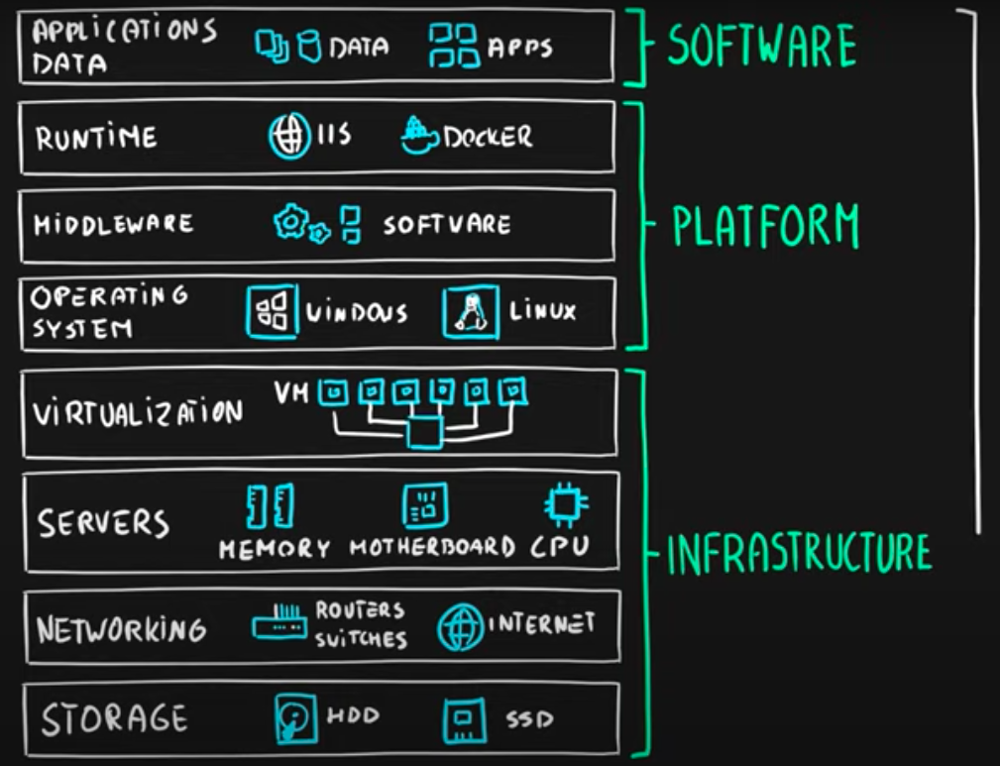

## Azure CLoud Terminology 

### Data center 

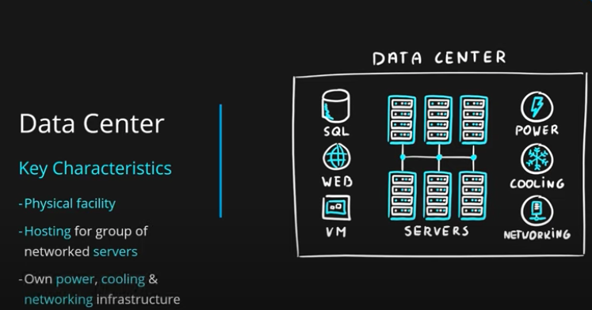

### Regions -- HA network connected to one or more Data center

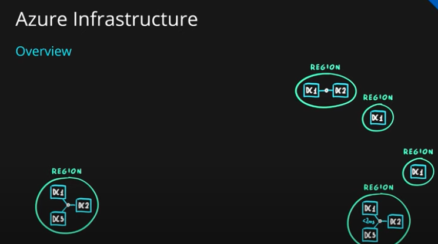

### Region more details 

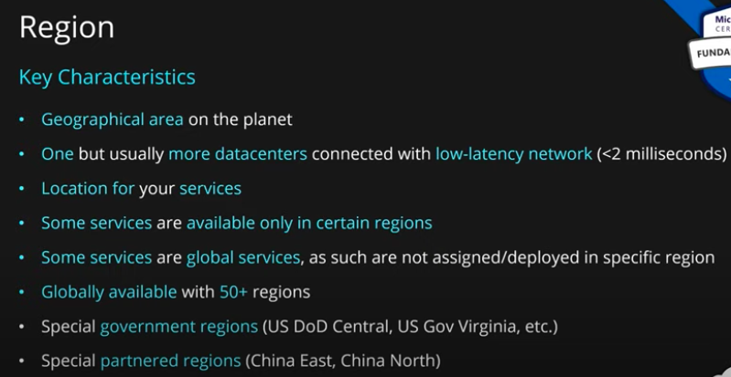

### to check azure cloud region network latency 

[Azure Region Network latency check](https://www.azurespeed.com/)

## Availability zones 

### Group of DC to overcome failoure 

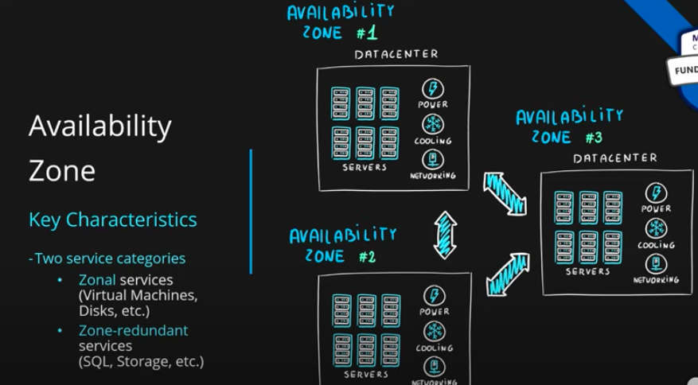

### av can have one or more Dc

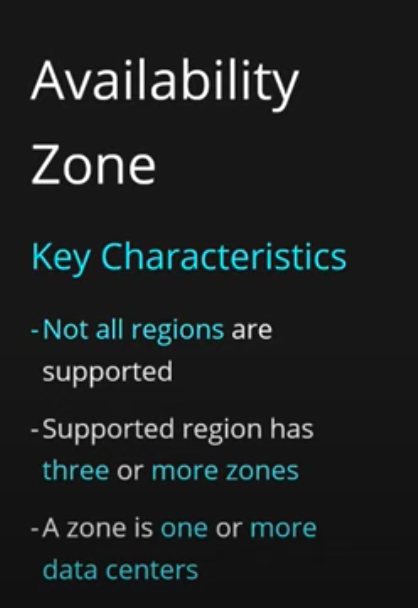

### For region failure microsoft have pair region -- 300 miles away 

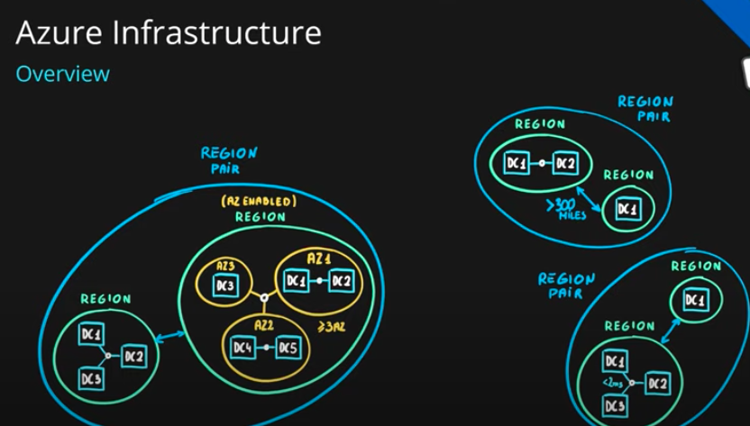

### pairs region info 

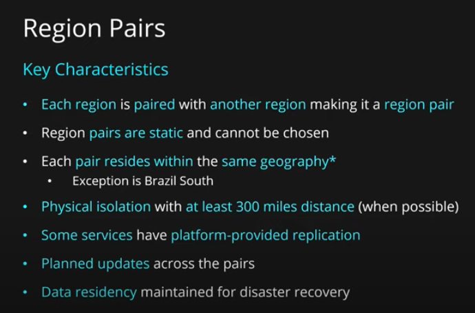

### Region pair example 

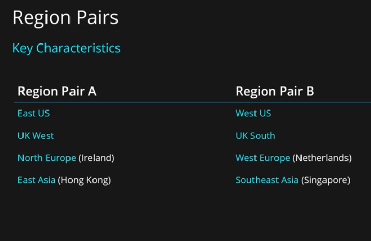

### Geography 

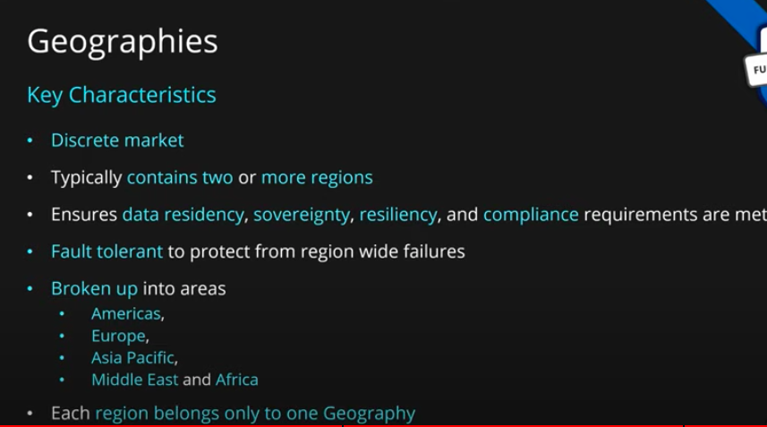

## Resources

### Resources 

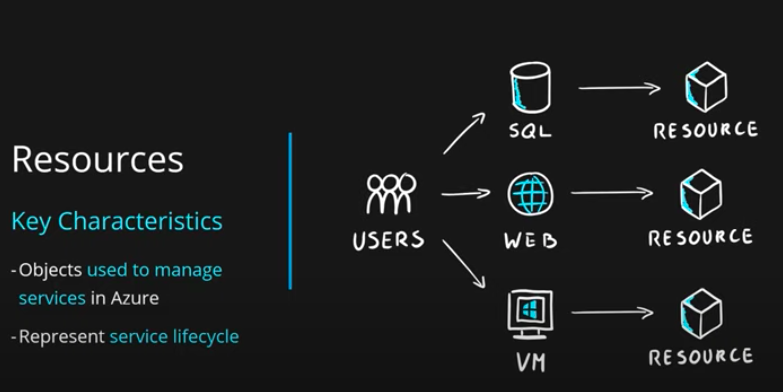

### each resources are stored in JSON template -- 

### Grouping resource for better management  / same kind resource grouping / for specific billing and monitoring  / specific location 

### we can also assign roles and permission to resources group 

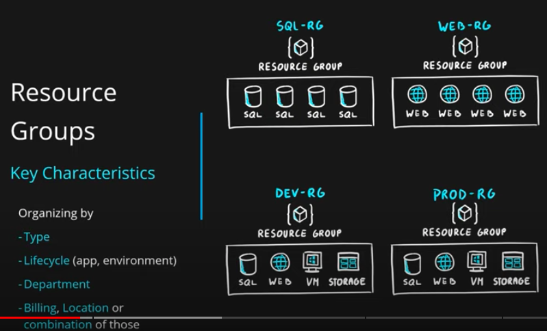

