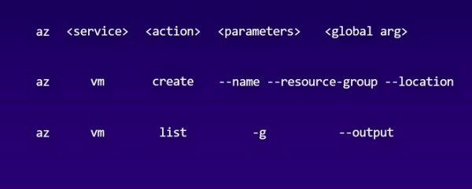

# azure cli

## A way to manage azure resources in with these features

<ul>
  <li> simple </li>
  <li>  cross platform </li>
  <li> stable </li>
  <li> automation </li>
  
</ul>  

## Installing azure cli

[![Installation]  (https://docs.microsoft.com/en-us/cli/azure/install-azure-cli)]

## Installing on MAc

```
brew update
brew install azure-cli

```

## Loging to azure cli

```
❯ az login
The default web browser has been opened at https://login.microsoftonline.com/common/oauth2/authorize. Please continue the login in the web browser. If no web browser is available or if the web browser fails to open, use device code flow with `az login --use-device-code`.


```
## Note: it will prompt for azure login details in default web browser

### azure cli offers two shells 

<ol>
  <li> Bash </li>
  <li> Powershell </li>
</ol>

## some azure commands 

###  checking version 

```
adhoc@Azure:~$ az version
{
  "azure-cli": "2.14.0",
  "azure-cli-core": "2.14.0",
  "azure-cli-telemetry": "1.0.6",
  "extensions": {
    "ai-examples": "0.2.4"
  }
}

```

### checking resources groups

```
adhoc@Azure:~$ az group list -o table
Name                              Location       Status
--------------------------------  -------------  ---------
NetworkWatcherRG                  westcentralus  Succeeded
cloud-shell-storage-centralindia  centralindia   Succeeded
DefaultResourceGroup-CUS          centralus      Succeeded
ashutoshhclires                   centralus      Succeeded

```

### a look to az command 



